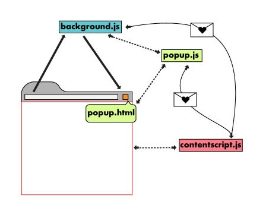
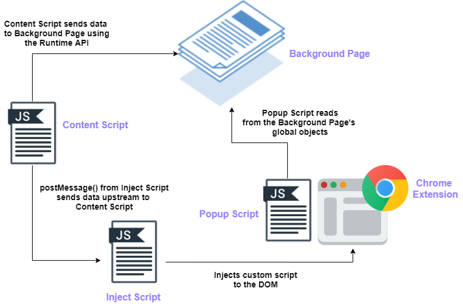
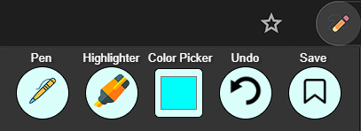
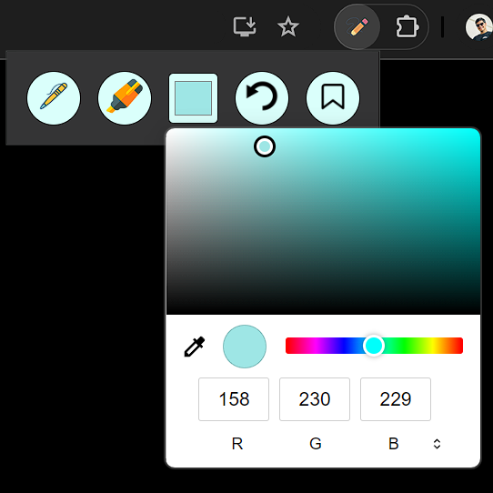
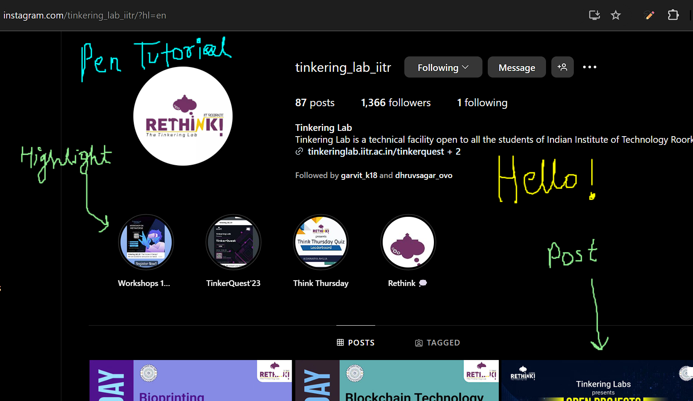
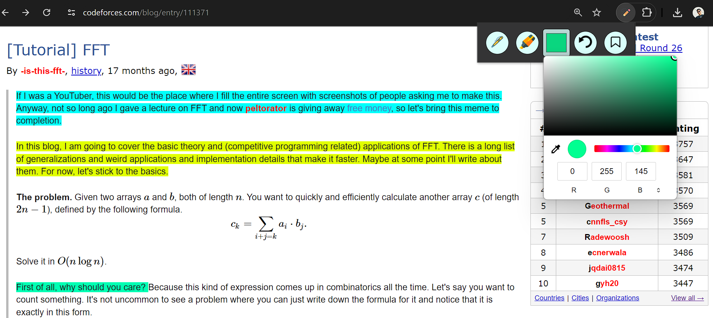
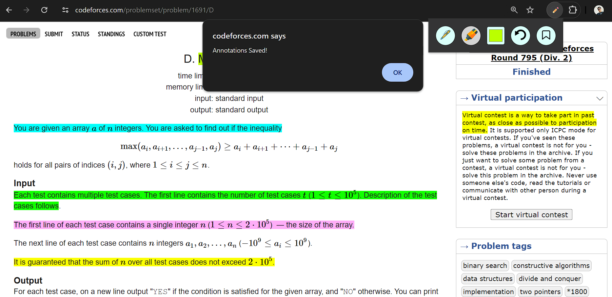
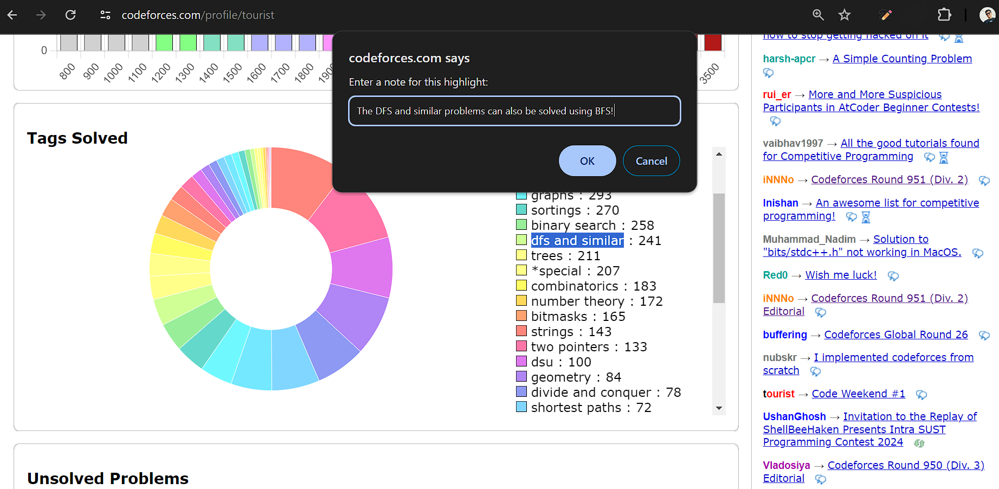
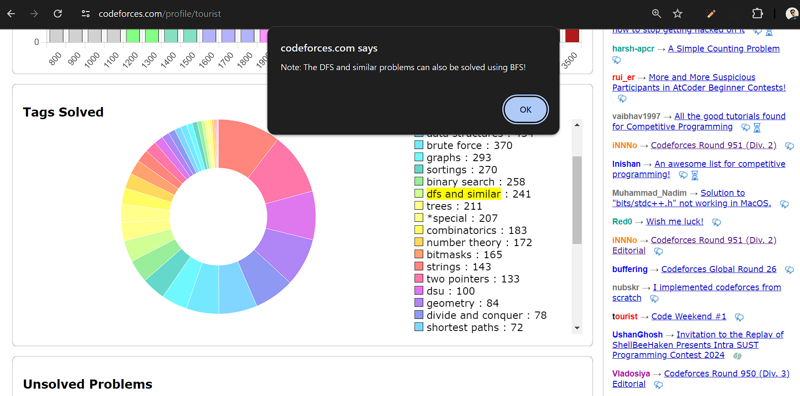

# Web Annotator
**Author** : Siddhant Rohila

## Abstract:
  The Web Annotator chrome extension is designed to enhance users'
  interaction with web content through a suite of powerful annotation
  tools. This extension allows users to highlight text on any webpage
  using customizable, color-coded highlights, enabling efficient
  categorization and organization of significant sections.
  Additionally, users can attach contextual notes to highlighted
  content, facilitating the addition of personal insights, comments, or
  supplementary information for future reference. One of the key
  features of this extension is the persistence of annotations across
  browser sessions, ensuring that users can revisit annotated pages with
  their highlights and notes intact even after closing and reopening the
  browser.
  This project report provides an overview of my project's architecture,
  features, implementation details, and the technologies used. It
  highlights the motivation behind the project, the challenges
  addressed, the novelty and application innovation, as well as the
  future directions for development.
  This extension has a variety of applications, it may be used in
  teaching sessions, self notes,for a meaningful explanation to others
  and many more. I've tried my best to make it robust and working for
  all systems across different screen sizes and resolutions.

  ## Table of Contents

1. [Introduction](#introduction)
2. [How a Chrome Extension is Created?](#how-a-chrome-extension-is-created)
3. [Implementation](#implementation)
4. [Concluding Remarks](#concluding-remarks)

# Introduction

-   **But what is a Web Annotator?:** A web annotator, in this context,
    is a Chrome extension that enhances user engagement with online
    content by offering tools for highlighting and annotating text on
    any webpage. It allows users to mark key sections with customizable
    color-coded highlights and add personal notes for additional
    context. These annotations are saved and persist across browser
    sessions, ensuring users can access their work anytime. The
    extension also provides features like keyboard shortcuts and a
    responsive design for optimal use on various devices. It aims to
    boost efficiency and organization for researchers, students, and
    professionals.

-   **Motivation of Project:** As soon as Tinkering Labs released this
    project, I thought of starting with my hands-on web development
    experience since I've never tried it before. It was a fun task and I
    learnt many things while its execution. Also this project is quite
    useful for teachers as well as students in order to explain and
    understand the concepts available online, well. I also wanted to
    enhance my JavaScript skills by implementing a variety of functions
    which was fulfilled by working on this project. I have never
    developed a chrome extension hence I was excited for making this.

-   **Application Domain:**

    1.  **Education**: Enhancing the learning experience for students
        and educators by allowing them to highlight and annotate online
        course materials, academic papers, and e-books.

    2.  **Research**: Assisting researchers in efficiently marking and
        taking notes on online journals, articles, and other digital
        resources, facilitating better organization and retrieval of
        information.

    3.  **Professional Use**:Helping professionals in various fields to
        annotate and review online reports, documents, and resources,
        improving productivity and collaboration.

    4.  **Personal Knowledge Management**: Aiding individuals in
        bookmarking, highlighting, and annotating web content for
        personal projects, interests, or daily reading, promoting better
        knowledge retention and organization.

    5.  **Collaborative Work**:Supporting collaborative annotation and
        sharing among teams, enabling better communication and idea
        exchange in academic, professional, and personal contexts.

# How a chrome extension is created?

A typical chrome extension is created by the numerous files, and it is
further loaded unpacked in the developer mode. These files are as
follows:

1.  **The Manifest File (manifest.json)** : The manifest file is a JSON
    file that provides essential information about the extension. It
    includes details such as the extension's name, version, description,
    permissions (e.g., access to tabs, storage, and web requests),
    content scripts, background scripts, icons, and more. It serves as
    the roadmap for Chrome to understand how the extension should behave
    and what resources it requires. Hence it the first file ever to be
    created when making an extension!

2.  **Background Script (background.js)**: The background script runs in
    the background and is responsible for managing the extension's core
    functionality. It's specified in the manifest file under the
    \"background\" key. This script can listen for events such as tab
    changes, browser actions, and network requests. It's also used to
    maintain the extension's state and handle tasks that don't require
    user interaction.

3.  **Content Script (content.js)**: Content scripts are injected into
    web pages based on specified URL patterns defined in the manifest
    file. These scripts can interact with the DOM of the web page,
    modify its content, and communicate with the background script using
    message passing. Content scripts are often used to enhance or modify
    the behavior of specific web pages to provide additional
    functionality.

4.  **Popup HTML (popup.html) and Popup Script (popup.js)**: If your
    extension has a browser action or page action that displays a popup
    when clicked, you'll need a popup.html file to define the structure
    of the popup and a popup.js file to handle its logic. The popup can
    contain UI elements such as buttons, input fields, or other
    interactive components. The popup script can interact with the
    background script and perform actions based on user input.

5.  **Icons and Other Assets**: Icons are crucial for representing the
    extension in the Chrome Web Store and in the browser toolbar. The
    manifest file specifies various icon sizes for different use cases.
    Additionally, you may include other assets such as images or CSS
    files for styling your extension's UI.\
    \
    The interaction between the components of a Chrome extension is
    essential for its seamless operation. Figure 1 and 2 will help for a
    better understanding as it visually demonstrates how a chrome
    extension works.

    

  
  
<em>Figure 1: Architecture Overview</em>

  
  
<em>Figure 2: Flowchart</em>

# Implementation

This project solely uses the following tech stacks:

1.  **HTML**:Utilized for creating the structure and layout of the
    buttons and containers.

2.  **CSS**:Employed for styling the buttons, containers, and defining
    their appearance, including hover and active states.

3.  **JavaScript**: Instrumental in implementing the functionality of
    the buttons, such as pen drawing, text highlighting, undoing
    actions, and saving.

### How does the extension look?
Initially the extension looks like this:

  
  
<em>Figure 3: Basic layout of the extension</em>

This the default color picker of HTML, I used it since it has a wide
range of colours and the user can select the as per convenience.

  
  
<em>Figure 4: Color selection</em>

### Functionality Implementation:

- **Pen Functionality:** The 'pen' class
    is utilized for styling the button representing the pen tool. The
    pen functionality in this project is implemented through a series of
    JavaScript functions and event listeners that enable drawing on the
    canvas using the mouse. Let's review the relevant parts of the code
    to understand how the pen functionality is implemented:

    1.  **Event Listeners:**

        -   **canvas.addEventListener('mousedown', startDrawing)**: This
            event listener triggers the startDrawing function when the
            mouse button is pressed down on the canvas, signaling the
            beginning of a drawing action.

        -   **canvas.addEventListener('mousemove', draw)**: When the
            mouse is moved over the canvas, the draw function is called
            to update the drawing based on the current mouse position.

        -   **canvas.addEventListener('mouseup', stopDrawing)**: This
            event listener detects when the mouse button is released,
            indicating the end of drawing, and calls the stopDrawing
            function.

        -   **canvas.addEventListener('mouseout', stopDrawing)**: If the
            mouse moves out of the canvas area, the stopDrawing function
            is triggered to ensure drawing stops even if the mouse
            leaves the canvas.

    2.  **Drawing Functions:**

        -   **startDrawing(event)**: This function is called when the
            mouse button is pressed down on the canvas. It initializes
            the drawing process by setting up the initial coordinates
            for drawing.

        -   **draw(event)**: The draw function is responsible for
            updating the drawing based on the current position of the
            mouse. It connects the previous and current mouse positions
            to create a continuous line as the mouse moves.

        -   **stopDrawing()**: When the mouse button is released or
            moves out of the canvas, the stopDrawing function is called
            to end the drawing action.

    3.  **Drawing Implementation:**

        -   Within the draw function, various properties of the 2D
            rendering context (ctx) are utilized to implement the
            drawing functionality, such as setting the stroke color,
            line width, and drawing paths using methods like beginPath,
            moveTo, lineTo, and stroke.

    Combining these elements, the pen functionality is achieved by
    capturing mouse events and updating the canvas based on mouse
    movement, resulting in a smooth drawing experience. The 2D rendering
    context (ctx) provides the necessary methods and properties to
    control the appearance and behavior of the pen tool on the canvas.
  
    Below is a screenshot of the tutorial of the pen functionality:

    

    
    
<em>Figure 5: Annotating free hand on a web page (instagram.com)</em>

  

-  **Text Highlighter Functionality:** The 'highlight-btn'
    class defines the styling of the button representing the text
    highlighter tool.JavaScript is utilized to implement the text
    highlighting functionality by detecting user text selection and
    applying a background color to the selected text or a specific area
    on a webpage. Let's review the relevant parts of the code to
    understand how this function works :

    1.  **Function highlightSelection:**

        -   The function starts with a conditional check to ensure that
            the current tool is set to 'text-highlighter'. If it's not,
            the function returns early, indicating that the text
            highlighting functionality should not be executed with a
            different tool.

    2.  **Getting the Selection:**

        -   The function retrieves the current selection within the
            document using window.getSelection(). This selection
            represents the text range that the user has highlighted.

    3.  **Checking for Collapsed Selection:**

        -   The function checks if the selection is collapsed (i.e.,
            empty or not highlighting any text). If the selection is
            collapsed, the highlighting process is not initiated.

    4.  **Creating a Span Element:**

        -   If the selection is not collapsed, the function proceeds to
            create a new span element, which will be used to wrap the
            highlighted text. The span element's background color is set
            to the current color (currentColor) associated with the
            highlighting tool.

    5.  **Extracting and Wrapping Content:**

        -   The function then extracts the contents of the selected
            range using range.extractContents() and appends them inside
            the newly created span element. This effectively wraps the
            highlighted text within the span element.

    6.  **Storing Annotation Information:**

        -   Once the highlighting is applied, the function removes the
            selection range using selection.removeAllRanges() to clear
            the user's selection.

        -   Additionally, it adds an annotation object to an annotations
            array, containing information about the highlighted text,
            such as the tool used ('text-highlighter'), the HTML
            representation of the highlighted span, the XPath of its
            parent element, and a unique ID for the span.

    7.  **Function getXPath:**

        -   The getXPath function is used to generate an XPath
            expression for a given DOM element. It handles cases where
            an element has an ID or needs to be located based on its
            position within its parent's children.

    Overall, this implementation captures user-selected text, wraps it
    in a span element with a specified background color, and stores
    annotation data for future reference. This allows users to visually
    highlight and annotate text within the document.
   
    Below is a screenshot of the tutorial of the Text-Highlighting
    functionality:

    

        
        
<em>Figure 6: Text Highlighting on codeforces.com </em>

    

- **Saving Functionality:** I have implemented the saving
    feature by separately writing functions for saving and loading
    annotations.The annotations are stored using the Chrome Storage API,
    specifically chrome.storage.local.When annotations are saved, they
    are stored as an object with keys 'annotations' and 'highlights'.The
    data is saved locally within the extension's sandboxed storage area,
    ensuring that the annotations persist even if the user closes or
    refreshes the webpage. By storing annotations locally, they can be
    retrieved and displayed whenever needed, providing a seamless user
    experience in accessing previously made annotations on webpages. If
    the user switches to a different device or clears their browsing
    data, they will lose all their saved annotations.

    1.  **Function saveAnnotations:**

        -   This function is responsible for saving the annotations
            array to the local storage. It uses
            chrome.storage.local.set() to store the annotations.

        -   If an error occurs during the saving process, it logs the
            error and sends a response indicating the failure.

        -   If the annotations are saved successfully, it logs a success
            message and sends a response indicating success.

    2.  **Function loadAnnotations:**

        -   This function is used to load the saved annotations from
            local storage. It retrieves the annotations using
            chrome.storage.local.get('annotations').

        -   If annotations are successfully loaded, it assigns the
            retrieved data to the annotations variable and calls a
            redraw() function (not provided in the code snippet).

    3.  **Message Listener for Saving and Loading Annotations:**

        -   The chrome.runtime.onMessage.addListener() function listens
            for messages from the content script or other parts of the
            extension.

        -   If the message action is "saveAnnotation\", it saves both
            annotations and highlights to local storage using
            chrome.storage.local.set().

        -   If the message action is "loadAnnotations\", it retrieves
            both annotations and highlights from local storage using
            chrome.storage.local.get(\['annotations', 'highlights'\])
            and sends them as a response.

    Below is a screenshot of the saving functionality:

    

        
        
<em>Figure 7:Saving annotations on a webpage </em>

    

- **Adding Notes Functionality:** So in this feature we
    can add notes corresponding to any highlighted text. The note is
    visible once you click this highlighted text. The "adding notes"
    feature in this project works by leveraging event listeners to
    detect text selection, prompting the user to enter a note, and
    wrapping the selected text in a span element. This span element
    stores the highlight color and a unique identifier, allowing for the
    retrieval and display of notes when the highlighted text is clicked.
    This functionality is crucial for creating an interactive and
    informative user experience.

    1.  **Event Listener Setup:**

        -   An event listener is added to the document, specifically
            listening for click events.

        -   This allows for interaction with highlighted text spans.

    2.  **Checking Target Element:**

        -   When a click event occurs, the target element (the element
            clicked on) is examined.

        -   The code checks if the clicked element is a span and has the
            attribute 'highlight-id', indicating it's a highlighted text
            span.

    3.  **Retrieving Highlight ID:**

        -   If the clicked element is a highlighted text span, its
            'highlight-id' attribute value is retrieved.

        -   This ID serves as a unique identifier for the highlighted
            text.

    4.  **Finding Highlight Object:**

        -   Using the retrieved highlight ID, the code searches for the
            corresponding highlight object in the highlights array.

        -   The highlight object contains information about the
            highlighted text, including any associated notes.

    5.  **The final display of the note:**

        -   If a highlight object is found and it has a note associated
            with it, an alert message is displayed.

        -   The alert message shows the note associated with the
            highlighted text.

    Below is a screenshot of the saving functionality:

    

        
        
<em>Figure 8:Adding a note to a highlight </em>

    

    

        
        
<em>Figure 8:How a note appears when you click on a
    highlight </em>

    

# Concluding Remarks

Starting this project as a newbie in web development has been quite a
ride. Making a web annotator Chrome extension has been a mix of learning
and experimenting. Even though I'm still learning the ropes, putting
this extension together has been a lot of fun.\
The idea behind the extension is to give people a handy tool for
organizing their online research. It's got a bunch of cool features like
letting you draw on web pages, highlight text, jot down notes, and save
stuff you find useful. The current version of the extension has a few
bugs and glitches that might cause issues on certain devices. But I'm on
it, working hard to iron out those kinks and make it run smoother.\
One thing that's been a bit tricky is that the extension only uses
JavaScript for its backend stuff. That means it doesn't have an external
database to store and retrieve data, which could limit what it can do in
the future. But I'm looking into ways to change that and make it even
better.\
In the end, this project has been a journey of learning and growth. And
with every bug fixed and feature added, I'm getting closer to making
something that people will find really useful. I would like to conclude
this report here.
